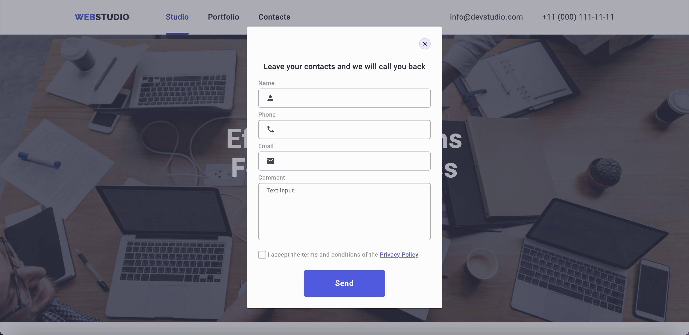
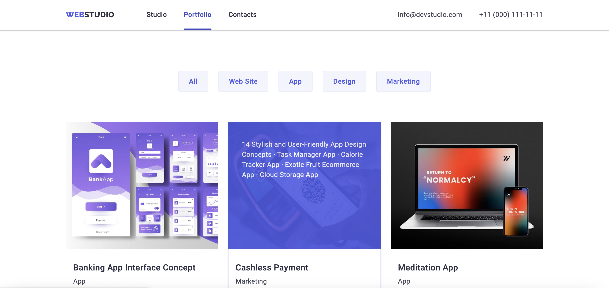

# WebStudio

**WebStudio** is a website with adaptive design, a burger menu, a modal window, and transform effects. This is my first individual project.

## Features
- **Adaptive Design**: The website automatically adjusts to different screen sizes.
- **Burger Menu**: Simplified navigation for mobile devices.
- **Modal Window**: Pop-up windows for additional information or forms.
- **Transform Effects**: Smooth animations and transitions for an enhanced user experience.

## Technology Stack
- **HTML5**
- **CSS3**
- **JavaScript**

## Screenshots

### Home Page

### Modal Window

### Portfolio Page

